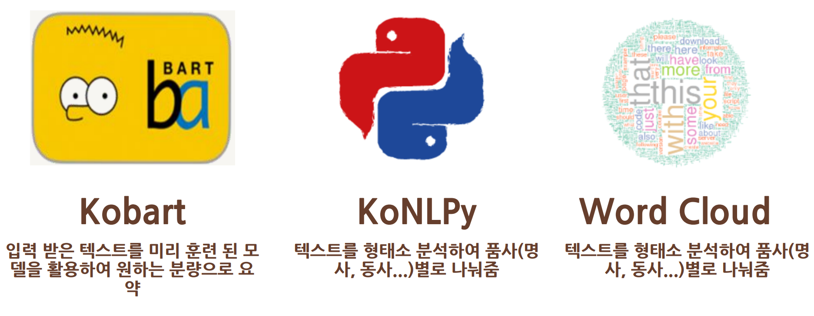
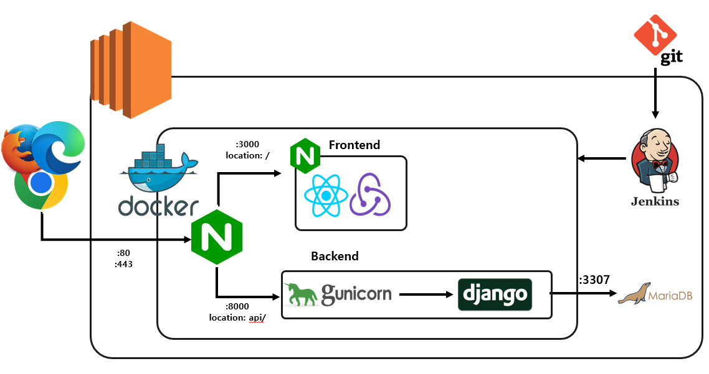

# :notebook: 3 Minutes For 1 Minute

> 3분에 하나의 회의를 끝내는 STT 기반의 비동기식 회의 서비스
>
> 


## :balloon: 프로젝트 개요

**:star: Backend**:      

**:star: Frontend**:    

##### :star: CI / CD:     


- 진행기간: 2022.02.21 ~ 2022.04.08
- 소개

> **3 Minutes For 1 minute**(이하 3MFM)은 비대면이 활성화되는 시대에서 한 명의 회의 담당자와 여러 명의 회의 담당자들이 개별적으로 **3분의 스피치**를 통해 안건에 대한 의견을 제시할 수 있는 새로운 회의 방식의 서비스이다.


- 특징
  - 요약 기능
    -  3분의 스피치 내용을 한 문장으로 또는 여러 문장으로 요약하여 해당 스피치의 요점 파악에 용이하다.
    - 워드클라우드로 높은 빈도로 사용된 핵심 키워드를  한 눈에 볼 수 있다.
  - 시공간의 자유로움
    - 언제 어디서든 회의 시작부터 회의 종료 시간까지의 시간만 맞춘다면 본인의 의견을 간단하게 3분 내로 표현할 수 있다.
  - 피드백의 활성화
    - 각각의 참여자의 스피치에서 댓글을 달 수 있고 관련 파일을 업로드하여 의견의 설득력을 보탤 수 있다.
<br/>


## :robot: AI

1. STT(Speech To Text) 및 문법 검사


2. 문장 요약 및 워드클라우드화


<br/>


## :bowling: 주요 기능

| 순번 | 기능                | 내용                                                         |
| :--: | :------------------ | :----------------------------------------------------------- |
|  1   | 커뮤니티 가입, 생성 | 커뮤니티를 생성하거나 이미 만들어진 커뮤니티에 가입할 수 있다. |
|  2   | 커뮤니티 메인       | 가입된 커뮤니티의 전체 페이지를 확인할 수 있다.<br />회의록, 게시글, 회원의 개략적인 정보를 알 수 있다.<br />좌측의 사이드바를 통해 원하는 기능을 이용할 수 있다. |
|  3   | 프로필 조회 및 변경 | 커뮤니티 멤버로서 본인의 프로필과 본인 계정 프로필을 조회 및 수정 가능하다. |
|  4   | 회의록 작성         | 작성 일자, 작성자, 제목, 첨부 파일 등 필요한 정보를 기입하여 회의록 작성이 가능하다.<br />회의록이 작성되면 참여자들은 스피치 등록 버튼을 통해 스피치를 생성할 수 있다.<br /><br />회의 종료일 전에 회의 종료 버튼을 통해 회의를 조기 종료할 수 있다. |

- **Sample UI(1~4)**


<br/>

| 순번 | 기능                | 내용                                                         |
| :--: | :------------------ | :----------------------------------------------------------- |
|  5   | 스피치 생성         | 스피치 시작 버튼을 누르고 참여자의 스피치를 음성 녹음을 통해 작성할 수 있다. |
|  6   | 스피치 등록 및 조회 | Kobart를 통해 요약된 스피치 내용을 확인할 수 있다.<br />KoNLPy를 통해 나눠진 단어의 데이터의 빈도수별로 Word Cloud화한다. <br />STT를 통해 생성된 스피치 전문과 음성 파일이 저장된다. |
|  7   | 달력형 회의록       | 회의록의 전체 일정을 달력형으로 볼 수 있다.<br />기간별로 회의를 바 형태로 보여준다. |
|  8   | 회원관리            | 관리자는 회원관리 페이지에서 멤버 초대, 가입 수락 및 추방이 가능하다.<br />커뮤니티의 정보를 수정할 수 있다. |

- **Sample UI(5~8)**

<br/>


## :tada:아키텍쳐




## :family_man_man_boy_boy: 팀원 소개

##### :crown: Chang-gi Jeon

- 역할: 팀장 / AI
- Github: [@ChanggiJeon](https://github.com/ChanggiJeon)

#####  

##### :horse: Jae-sung Yoon

- 역할: Backend / Infra
- Github: [@Jaeseed](https://github.com/Jaeseed)

##### :cactus: Su-won Jang

- 역할: Backend
- Github: [@kielj](https://github.com/kielj)

##### :santa: Jong-hyeon Kim

- 역할: Frontend
- Github: [@Jhon-Kim93](https://github.com/Jhon-Kim93)

#####  :candy: Hyun-bae Ji

- 역할: Frontend
- Github: [@ruokic](https://github.com/ruokic)

##### :clown_face: Jong-mok Yoon

- 역할: Frontend
- Github: [@yoonjongmok](https://github.com/yoonjongmok)
<br/>


## ⚙ 개발 환경 및 IDE

- **DevOps**

  - AWS EC2

  - Ubuntu: 20.04.4 LTS

  - Docker: 20.10.14

  - Docker-compose: 1.29.2

  - Jenkins


- **FE**
  - node: 16.3.11


- **BE**

  - django: 4.0.3

  - conda: 4.10.3

  - python: 3.10.4


- **DB**
  - mariaDB: 10.3.34


- **IDE**
  - Visual Studio Code
<br/>


## 설치

- Docker

```bash
# 업데이트 및 HTTP 패키지 설치
sudo apt update
sudo apt-get install -y ca-certificates \ 
    curl \
    software-properties-common \
    apt-transport-https \
    gnupg \
    lsb-release

# GPG 키 및 저장소 추가
curl -fsSL https://download.docker.com/linux/ubuntu/gpg | sudo gpg --dearmor -o /usr/share/keyrings/docker-archive-keyring.gpg

# Docker engine 설치
sudo apt update
sudo apt install docker-ce docker-ce-cli containerd.io
```

- Docker-compose

```bash
# docker-compose 설치
sudo curl -L "https://github.com/docker/compose/releases/download/1.29.2/docker-compose-$(uname -s)-$(uname -m)" -o /usr/local/bin/docker-compose

# docker-compose 권한 부여
sudo chmod +x /usr/local/bin/docker-compose

# docker-compose 실행 파일 바인딩
sudo ln -s /usr/local/bin/docker-compose /usr/bin/docker-compose
docker-compose -version
```

- docker-compose 실행

```
# /workspace/
# Gunicorn 실행 sh 파일 권한 부여
chmod +x BE/api/wsgi-entrypoint.sh
chmod +x BE/api/manage.py

# docker compose 빌드
docker-compose build

# docker compose container 실행
docker-compose up -d

# BE container 접속
docker exec -it <BE container 명> bash

# python daemon 실행
python Thread.py
```
<br/>

## :package:포트

| 80   | nginx(http / redirect to 443) |
| ---- | ----------------------------- |
| 443  | nginx(https)                  |
| 3000 | Gunicorn -> Django            |
| 3307 | DB (mariaDB)                  |
| 8080 | Jenkins                       |
<br/>


## 🎞 최종산출물

<a href="static/최종발표.pdf" style="text-decoration:none">최종 발표 pdf</a>

<a href="https://youtu.be/2j-PVb5Gpk0" style="text-decoration:none">3 Minutes For 1 Minute UCC 보러 가기</a>

